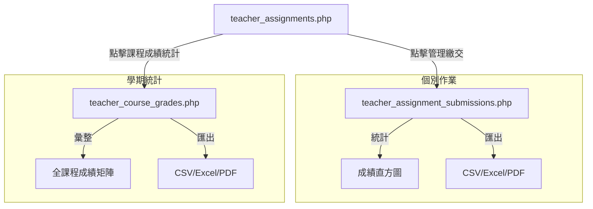

# 成績統計與下載功能規劃

## 功能概覽
本計畫旨在為老師與助教提供更完善的成績管理工具，包含直方圖可視化分析以及多格式成績匯出功能。

### 1. 個別作業成績統計 (`teacher_assignment_submissions.php`)
- **直方圖**: 使用 Chart.js 呈現 0-100 分的級距分佈。
- **匯出功能**:
  - **CSV/Excel**: 產生成績清單，包含學號、姓名、得分、評語。
  - **PDF**: 產生美觀的列印版成績報表。

### 2. 學期課程成績統計 (`teacher_course_grades.php`)
- **彙整表格**: 展示該課程所有學生在所有作業中的得分。
- **統計分析**: 顯示各項作業的平均分、最高分、最低分。
- **匯出功能**: 支援整學期成績矩陣的匯出。

## 系統流程圖

## 實作細節
### 資料導出方案
- **CSV**: 使用 PHP `fputcsv` 並加入 UTF-8 BOM (`\xEF\xBB\xBF`) 以確保 Excel 開啟不亂碼。
- **Excel**: 沿用 CSV 方案 (因其輕量且易於實作)，若需特定樣式則使用 HTML Table 格式。
- **PDF**: 建議使用 CSS `@media print` 優化頁面佈局，讓老師直接透過瀏覽器「另存為 PDF」。

### 直方圖區間 (Bin)
- 0-9, 10-19, 20-29, ..., 90-100 (共 10 個區間)。
